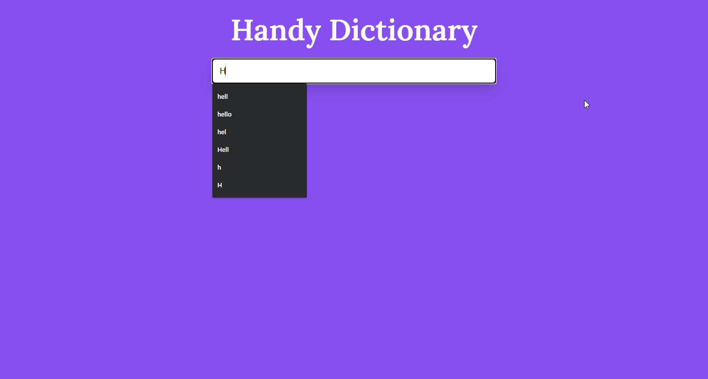

# Handy Dictionary

### A word searching system with auto-complete

## Table of contents

- [Overview](#overview)
  - [The challenge](#the-challenge)
  - [Screenshot](#screenshot)
  - [Links](#links)
- [My process](#my-process)
  - [Built with](#built-with)
  - [What I learned](#what-i-learned)
  - [Continued development](#continued-development)
  - [Useful resources](#useful-resources)
- [Author](#author)
- [Acknowledgments](#acknowledgments)

## Overview

### The challenge

User should be able to search any valid word. The users didn't have to worry about the spelling, this app will suggest some near words to the user.

### Links

- Solution URL: [Git Repo](https://github.com/moeen-mahmud/handy-dictionary)
- Live Site URL: [Live Site](https://handy-dictionary.vercel.app/)

## My Process

### Built With

- HTML5 markup
- Vanilla JS
- aync/await
- Mobile-first workflow
- [GoogleFonts](https://fonts.google.com/) - For font styles

### What I learned

I took this challenge as to practice the auto-suggestions technique. Although, I didn't impliment the RegExp. I want to do this without using regex and try to use the `keyup` event.

### Continued Development

I really enjoy doing this project. It was relatively easy but as I use the static API that has no query method, it shows error when it couldn't find any word. I tried to catch the error with try...catch block and consoled the error message.

### Useful resources

[MDN - Documentation](https://developer.mozilla.org/) - It's very handy for a quick lookup.

## Author

- Twitter - [moeen_mahmud](https://twitter.com/moeen_mahmud)

## Acknowledgments

I'd like to thank [meetDeveloper](https://github.com/meetDeveloper) for the API. He created this free and awesome API all by himself. A huge clap goes to HIM.
